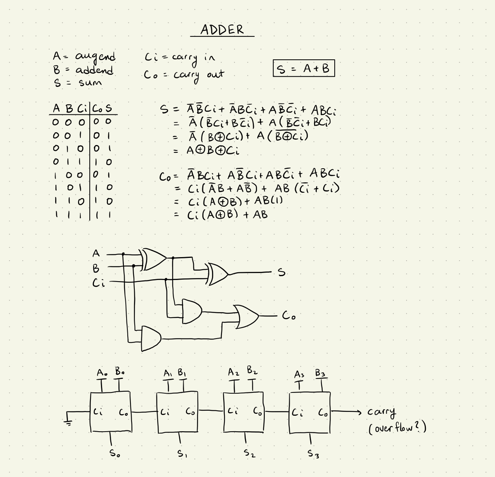
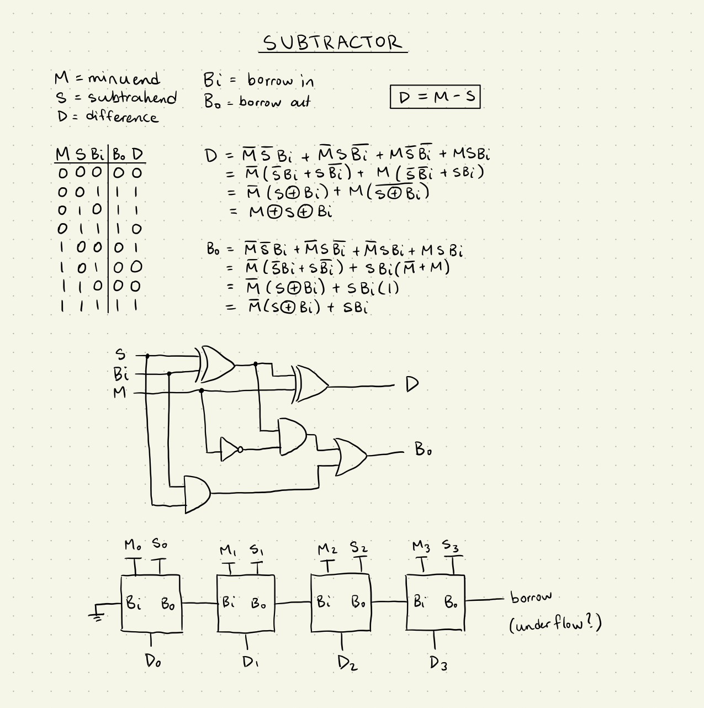
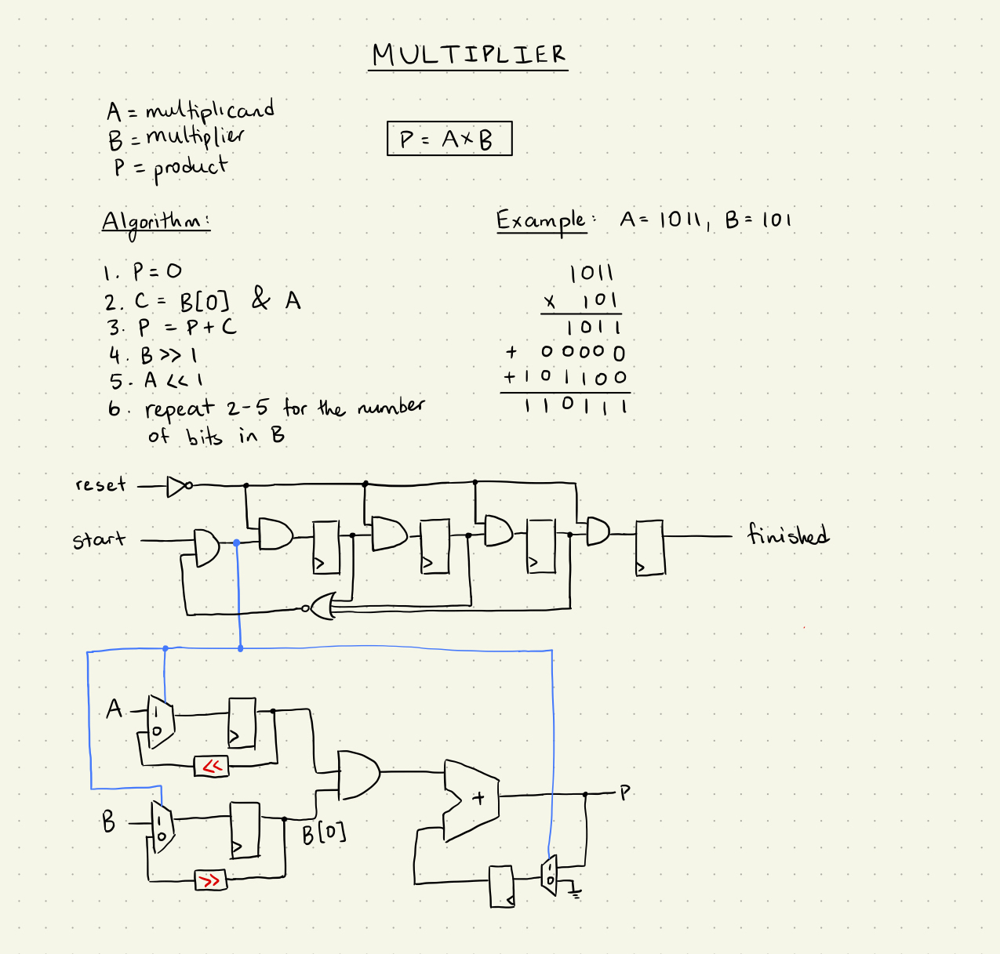
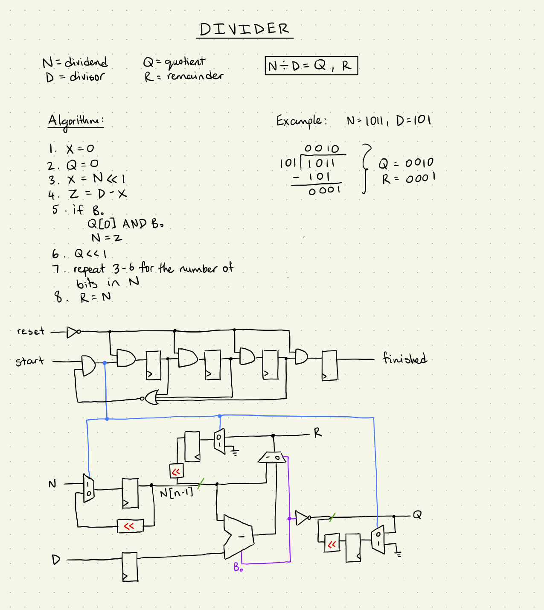
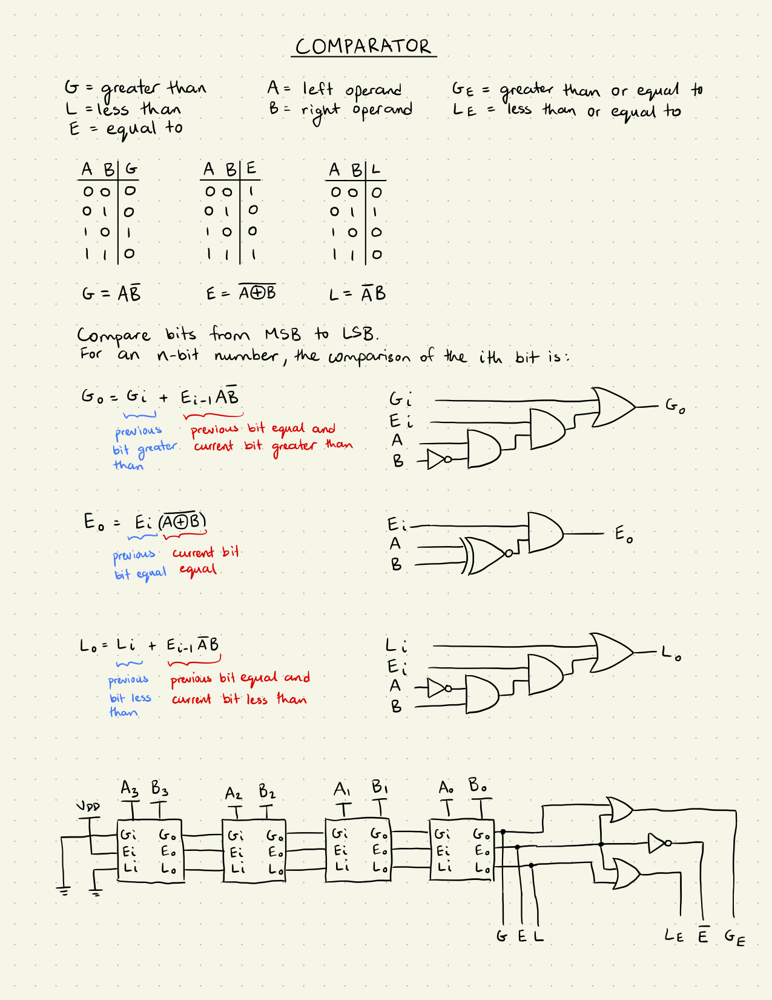
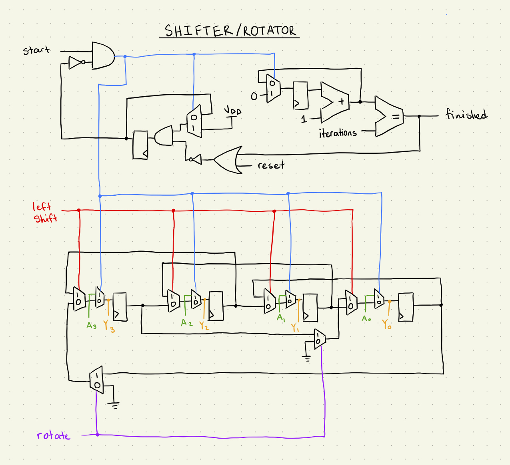
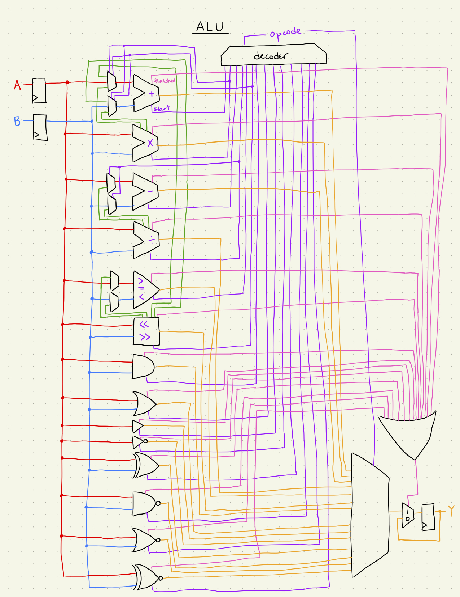

# Turing

Turing is a simple ALU circuit implemented in Verilog and verified via Icarus RTL simulations and CoCoTB testbenches.  It contains original circuits designs for basic arithmetic and logic circuits, which are listed below.  Note that the circuits are designed to operate in the same way that one would manually calculate the answer on paper.

## Adder

The adder is a combinational circuit with a latency of 1 clock cycle.  The design is based on the standard full adder circuit, and is implemented as a ripple adder consisting of many full adder circuits with a cascading carry bit.  The operation symbol is `+`.

## Subtractor

The subtractor is a combinational circuit with a latency of 1 clock cycle.  The design is similar to the full adder circuit but uses a borrow bit instead of a carry.  This design is implemented as a ripple subtractor consisting of many full subtractor circuits with a cascading borrow bit.  The operation symbol is `-`.

## Multiplier

The multiplier is a sequential circuit with a latency of N clock cycles, where N is the bit width of the operands.  It uses a 1-hot state machine to time the output and states of the circuit.  The product is accumulated using the adder circuit while the multiplication is performed using a bitwise AND between the operand bits.  The operands are shifted every cycle using shift registers.  The operation symbol is `*`.

## Divider

The divider is a sequential circuit with a latency of N clock cycles, where N is the bit width of the operands.  It uses a 1-hot state machine to time the output and states of the circuit.  The quotient is generated sequentially using the subtractor circuit.  The remainder is generated in parallel as a by-product of the division, which extends the divider's functionality as a modulo circuit.  The operands are shifted every cycle using shift registers.  The operation symbol is `/`.

## Comparator

The comparator is a combinational circuit with a latency of 1 clock cycles.  It uses a ripple configuration to compare each bit from MSB to LSB.  The result for each bit cascades down the chain of single-bit comparators.  Each single-bit comparator has parallel circuits for calculating `<`, `>`, and `=`.  The compound operators `<=`, `>=`, and `!=` are computed at the end.

## Shifter / Rotator

The shifter is a sequential circuit with a variable latency which depends on the number of shifts or rotations that a required.  This is tracked by using a counter register and the adder circuit as an incrementer.  The shifter will use a series of shift registers that can shift bits up and down.  In rotate mode, the LSB and MSB will loop directly around when a shift occurs.  This circuit does **not** support arithmetic right shifts (sign extension).  The operation symbols for left and right shift are `<<` and `>>` respectively.  The operation symbols for left and right rotate are `<<|` and `|>>` respectively, which are a variation of the shift symbols.

# ALU

The ALU circuit simply routes the inputs and outputs based on the decoded opcode.  It also handles the `start` and `finished` signals of the state machines.  Below is a high-level schematic of the ALU wiring:

